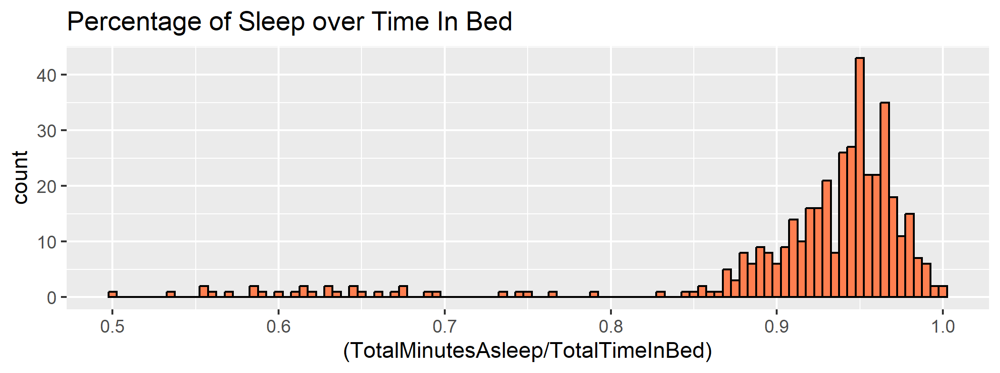

# bellabeat_case-study
# **Business Tasks**
How customers use smart devices through smart device usage data, so Bellabeat can introduce new marketing strategy.  
1. What are some trends in smart device usage?  
2. How could these trends apply to Bellabeat customers?  
3. How could these trends help influence Bellabeat marketing strategy?  

# **Stakeholders**
* Urška Sršen: Bellabeat’s cofounder
* Sando Mur: Mathematician and Bellabeat’s cofounder
* Other people in Bellabeat’s analytics team

# **Process & Analyze the data**
1. Setting up the environment and loading the datasets.  
```{r}
library(tidyverse)
library(lubridate)
library(dplyr)
library(ggplot2)
library(tidyr)
library(tibble)
```
```{r}
activity <- read_csv("C:...\\Documents\\Data Study\\Case Study\\Fitabase Data 4.12.16-5.12.16\\merge-activity-intensity.csv")
hourly_intensity <- read_csv("C:...\\Documents\\Data Study\\Case Study\\Fitabase Data 4.12.16-5.12.16\\hourlyIntensities_merged-2.csv")
sleep <- read_csv("C:...\\Documents\\Data Study\\Case Study\\Fitabase Data 4.12.16-5.12.16\\sleepDay_merged.csv")
daily_intensity <- read_csv("C:...\\Documents\\Data Study\\Case Study\\Fitabase Data 4.12.16-5.12.16\\dailyIntensities_edited.csv")
```
2. We can see the error of date format of those datasets. Now, we proceed to change the format in "sleep" dataset.  
```{r}
sleep$SleepDay = as.POSIXct(sleep$SleepDay, format = "%m/%d/%Y %I:%M:%S %p", tz = Sys.timezone())
sleep$time <- format(sleep$SleepDay, format = "%H:%M:%S")
sleep$date <- format(sleep$SleepDay, format = "%Y-%m-%d")
head(sleep)
```

Then, we proceed to change the format in "daily_intensity" and "hourly_intensity" dataset.  
```{r}
daily_intensity$ActivityDate <-strptime(daily_intensity$ActivityDate, format = "%Y-%m-%d")
format(daily_intensity$ActivityDate, format = "%Y-%m-%d")
hourly_intensity$ActivityDate <- strptime(hourly_intensity$ActivityDate, format = "%m/%d/%Y")
format(hourly_intensity$ActivityDate, format = "%Y-%m-%d")
format(hourly_intensity$ActivityHour, format = "%H:%M:%S")
head(hourly_intensity)
head(daily_intensity)
```

3. We are checking how correlated between sleep time and total time in bed.  

```{r}
ggplot(data=sleep, mapping=aes(x=(TotalMinutesAsleep/TotalTimeInBed))) + geom_histogram(color='black', fill='coral', binwidth = 0.005) + labs(title = "Percentage of Sleep over Time In Bed")
```
   
According to the chart, the most percentage people in sleep mode is 95% of time in bed. Almost people fall asleep fast when they are in bed, because the histogram is inclined to the range from 0.94 to 1.0.    

4. We draw visualizations to compare effect of Distance, Steps, and Intensity on burning calories.   

```{r}
ggplot(data=activity, mapping=aes(x = Calories, y = TotalSteps)) + geom_jitter(color = 'coral') +geom_smooth(color = 'black') + labs(title = "Total Steps vs. Calories Burnt")
```
   

```{r}
ggplot(data=activity, mapping=aes(x = Calories, y = TotalDistance)) + geom_jitter(color = 'coral') +geom_smooth(color = 'black') + labs(title = "Total Distance vs. Calories Burnt")
```

